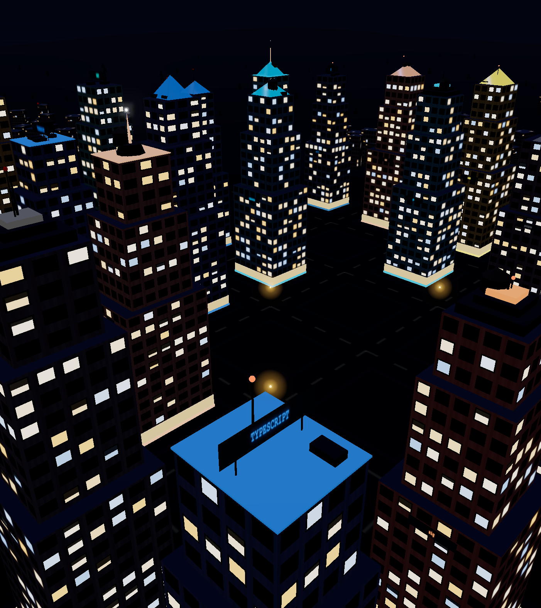

# ⚔️ Agent Fight City

**Two AI agents. One bug. A whole city watching.**

Every building in this 3D night city is a real GitHub repo. Click one, pick an
open issue, choose two AI fighters — and watch them battle to fix it. Each
agent works alone in its own sandboxed clone, on its own branch, hammering out
commits that stack up as glowing tower floors beside the repo. When both are
done, a referee walks into the arena, runs the *original* test suite against
both branches, reviews both diffs, scores the fight, **opens the winner's pull
request, and deletes the loser's branch**.

No canned animation. Every floor drop is a real commit. Every window pulse is
a real test run. Every verdict is a real PR on GitHub.



## Why this exists

Benchmarks tell you which model is better on average. Nobody ships "on
average". Agent Fight City answers the only question that matters at 2am:
*which agent fixes THIS bug in MY repo, without wrecking anything else* — and
it makes the answer fun enough to watch with popcorn.

## How a fight works

```
you click a building
        │
        ▼
┌─ POST /fight ──────────────────────────────────────────────┐
│  harness spawns two fighters in isolated git sandboxes     │
│                                                            │
│   🟠 fighter A ── branch fight/a-1f2e ── commit, test, …   │
│   🔵 fighter B ── branch fight/b-1f2e ── commit, test, …   │
│                                                            │
│  every action = one JSON event = one animation in the city │
│                                                            │
│   🟣 referee (clean 3rd sandbox):                          │
│      • runs MAIN's original tests on both branches         │
│        (gaming your local tests = instant loss)            │
│      • code-reviews both diffs, findings become events     │
│      • score = 60% pass rate + 25% review + 15% diff size  │
│      • opens winner's PR ✅  deletes loser's branch 🪦      │
└────────────────────────────────────────────────────────────┘
        │
        ▼
crane lowers the crown, loser's tower collapses in dust,
winner's floors fly onto the repo building. verdict on screen.
```

The frontend never contains fight logic — it is a pure renderer of a 10-event
JSONL contract. That means every fight is **replayable**: scrub the timeline
at the bottom and watch any moment again (the "4D" feature).

## The stack

| Piece | What it does |
|---|---|
| **Three.js city** | Procedural towers from live repo stats — height = stars, lit windows = commit activity, neon sign = language. Day and night themes. |
| **TrueFoundry AI gateway** | Runs the fighter and referee agent loops; every call, token, and cost visible in one dashboard. |
| **FastAPI + SSE** | `POST /fight` → subprocess harness → event stream. The server is a dumb pipe on purpose. |
| **Bright Data** | Scrapes the GitHub pages that seed and refresh the skyline — with a versioned scraper config and a heal log for when GitHub's markup shifts. |
| **Qodo** | Reviews every PR this repo merges, and the referee's PRs on the arena repo. |
| **Sandboxes** | Each fighter is jailed to its own shallow clone; path escapes are blocked at the tool layer. Fights run on a throwaway arena repo, never a real upstream. |

## Run it

```bash
pip install -r requirements.txt
uvicorn server.app:app --port 8000
# open http://localhost:8000  → click a building → START FIGHT
```

No API keys? Add `?mock=1` to the URL for a scripted fight, or hit START
FIGHT anyway — the server replays a recorded real fight so the demo never
bricks. With keys (`harness/.env`, see `.env` keys in `harness/llm.py`) every
fight is live: real sandboxes, real commits, real PR.

```bash
# fight from the terminal, no browser
python -m harness.fight --repo vercel/next.js \
  --task "slugify leaves trailing hyphens; make the suite pass" \
  --a sonnet --b gpt
```

## The event contract

Ten event types, one JSONL line each, from `session.opened` to
`session.closed`. The mock feed, the replay scrubber, the SSE stream, and the
real harness all speak exactly this schema — swap any of them and the city
cannot tell the difference. See `CLAUDE.md` for the full contract.

## What broke along the way

The honest log lives in [BLOG.md](BLOG.md) — including the Cloudflare 403
that only wanted a User-Agent, the shallow-clone fetch that never creates
`origin/<branch>`, and the referee correctly docking both fighters for
committing `__pycache__`.

## License

MIT. The city is procedural — no game assets, no AGPL code, nothing to buy.
